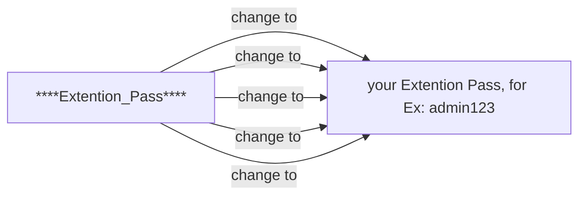

# Cisco_Phone_Config
Config Cisco phone  7941 and 7942 XML file

**First Step:** Copy load files to the tftpboot Directory

## Cisco 7941 IP_Phone
> ~: cp SIP41.8-54S.loads /tftpboot/

## Cisco 7942 IP_Phone
> ~: cp SIP42.85-3S.loads /tftpboot/

**Second Step:** Copy the Config file to the tftpboot Directory and change the file

> ~: cp SEP(Cisco_IP_Phone_.7941_MAC).cnf /tftpboot/
> ~: cp SEP(Cisco_IP_Phone_.7942_MAC).cnf /tftpboot/
> ~: vi  **SEP(Cisco_IP_Phone_.7941_MAC).cnf** or **SEP(Cisco_IP_Phone_.7942_MAC).cnf**
Change the parts between ** according to the guide below

